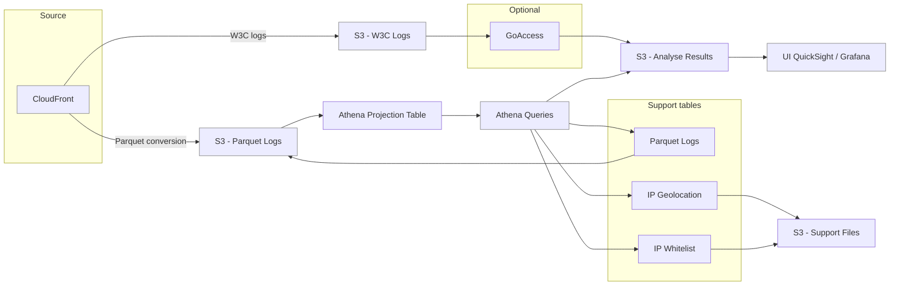

# CloudFront Logs Analyzer - Terraform Module

This module provides a AWS resources and helper scripts to analyze CloudFront Parquet logs using AWS Glue and Athena.

## Basic Usage
Minimal
```
module "global_logs_analyzer" {
  source  = "tx-pts-dai/cloudront/logs-analyzer"
  version = "2.0.0"

  s3_parquet_bucket = {
    name = "my-logs-abc"
    logs_prefix = "AWSLogs/{account_id}/Cloudfront/"
  }
  s3_results_bucket = {
    create = true
  }
}
```

Global
```
module "global_logs_analyzer" {
  source  = "tx-pts-dai/cloudront/logs-analyzer"
  version = "x.x.x"

  s3_parquet_bucket = {
    name = "my-logs-abc"
    logs_prefix = "AWSLogs/{account_id}/Cloudfront/"
  }

  s3_results_bucket = {
    create = true
  }

  # Do not place both files in the same folder
  # Athena would mix them up due to common column names
  s3_supporters_files = {
    ip_whitelist_fullpath = "s3://arn/full/path/to/folder"
    ip_whitelist_fullpath = "s3://arn/full/path/to/folder2"
  }
 
  grafana_access = {
    create = true
  }
}
```

Per Distribution
```
module "per_distrologs_analyzer" {
  source  = "tx-pts-dai/cloudront/logs-analyzer"
  version = "x.x.x"

  cloudfront_distribution = {
    id   = "{distribution-id-to-analyze}"
    name = "DistroName"
  }

  s3_parquet_bucket = {
    name = "my-logs-abc"
    logs_prefix = "AWSLogs/{account_id}/Cloudfront/{distro_id}/"
  }

  s3_results_bucket = {
    create = true
  }

  # Do not place both files in the same folder
  # Athena would mix them up due to common column names
  s3_supporters_files = {
    ip_whitelist_fullpath = "s3://arn/full/path/to/folder"
    ip_whitelist_fullpath = "s3://arn/full/path/to/folder2"
  }

  grafana_access = {
    create = true
  }
}
```

### What is here
- `*.tf` — Terraform resources to create a Glue database + tables, Athena workgroups/named queries, and optional S3 result buckets.
- `athena-queries/` — reusable SQL queries and templates (e.g. `detect_outliers.sql`).
- `scripts/` — small Python utilities: `jsonl_to_parquet.py` (convert JSONL support files to Parquet), helpers for generating whitelist/geolocation Parquet, and README.

### Quick architecture

CloudFront (Parquet logs in S3) -> Glue Data Catalog (tables) -> Athena queries (workgroup per env) -> Results in S3

Mermaid architecture diagram



## Improvements

- [ ] Provide a script to backfill logs from W3C to Parquet;
- [ ] Include an UI Platform to visualize the analysed data.

## Contributing

< issues and contribution guidelines for public modules >

### Pre-Commit

Installation: [install pre-commit](https://pre-commit.com/) and execute `pre-commit install`. This will generate pre-commit hooks according to the config in `.pre-commit-config.yaml`

Before submitting a PR be sure to have used the pre-commit hooks or run: `pre-commit run -a`

The `pre-commit` command will run:

* Terraform fmt
* Terraform validate
* Terraform docs
* Terraform validate with tflint
* check for merge conflicts
* fix end of files

as described in the `.pre-commit-config.yaml` file

## Terraform docs

Generated with `terraform-docs markdown --anchor=false --html=false --indent=3 --output-file=README.md .` from this directory

<!-- BEGIN_TF_DOCS -->
### Requirements

| Name | Version |
|------|---------|
| terraform | >= 1.10 |
| archive | >= 2.0 |
| aws | >= 6.0 |

### Providers

| Name | Version |
|------|---------|
| archive | 2.7.1 |
| aws | 6.36.0 |
| terraform | n/a |

### Modules

| Name | Source | Version |
|------|--------|---------|
| s3\_bucket\_preprocessing | terraform-aws-modules/s3-bucket/aws | 5.10.0 |
| s3\_bucket\_results | terraform-aws-modules/s3-bucket/aws | 5.10.0 |

### Resources

| Name | Type |
|------|------|
| [aws_athena_named_query.custom_named_queries](https://registry.terraform.io/providers/hashicorp/aws/latest/docs/resources/athena_named_query) | resource |
| [aws_athena_named_query.detect_outliers](https://registry.terraform.io/providers/hashicorp/aws/latest/docs/resources/athena_named_query) | resource |
| [aws_athena_workgroup.cloudfront_logs](https://registry.terraform.io/providers/hashicorp/aws/latest/docs/resources/athena_workgroup) | resource |
| [aws_cloudwatch_log_group.ua_lambda](https://registry.terraform.io/providers/hashicorp/aws/latest/docs/resources/cloudwatch_log_group) | resource |
| [aws_glue_catalog_database.cloudfront_logs](https://registry.terraform.io/providers/hashicorp/aws/latest/docs/resources/glue_catalog_database) | resource |
| [aws_glue_catalog_table.cloudfront_logs_parquet](https://registry.terraform.io/providers/hashicorp/aws/latest/docs/resources/glue_catalog_table) | resource |
| [aws_glue_catalog_table.ip_geolocation](https://registry.terraform.io/providers/hashicorp/aws/latest/docs/resources/glue_catalog_table) | resource |
| [aws_glue_catalog_table.ip_whitelist](https://registry.terraform.io/providers/hashicorp/aws/latest/docs/resources/glue_catalog_table) | resource |
| [aws_glue_catalog_table.preprocessed_user_agents](https://registry.terraform.io/providers/hashicorp/aws/latest/docs/resources/glue_catalog_table) | resource |
| [aws_iam_policy.grafana_access](https://registry.terraform.io/providers/hashicorp/aws/latest/docs/resources/iam_policy) | resource |
| [aws_iam_role.grafana](https://registry.terraform.io/providers/hashicorp/aws/latest/docs/resources/iam_role) | resource |
| [aws_iam_role.ua_lambda](https://registry.terraform.io/providers/hashicorp/aws/latest/docs/resources/iam_role) | resource |
| [aws_iam_role_policy.ua_lambda](https://registry.terraform.io/providers/hashicorp/aws/latest/docs/resources/iam_role_policy) | resource |
| [aws_lambda_event_source_mapping.ua_preprocessing](https://registry.terraform.io/providers/hashicorp/aws/latest/docs/resources/lambda_event_source_mapping) | resource |
| [aws_lambda_function.ua_preprocessing](https://registry.terraform.io/providers/hashicorp/aws/latest/docs/resources/lambda_function) | resource |
| [aws_lambda_layer_version.ua_deps](https://registry.terraform.io/providers/hashicorp/aws/latest/docs/resources/lambda_layer_version) | resource |
| [aws_s3_bucket_notification.ua_preprocessing](https://registry.terraform.io/providers/hashicorp/aws/latest/docs/resources/s3_bucket_notification) | resource |
| [aws_sqs_queue.ua_preprocessing](https://registry.terraform.io/providers/hashicorp/aws/latest/docs/resources/sqs_queue) | resource |
| [aws_sqs_queue.ua_preprocessing_dlq](https://registry.terraform.io/providers/hashicorp/aws/latest/docs/resources/sqs_queue) | resource |
| [aws_sqs_queue_policy.ua_preprocessing](https://registry.terraform.io/providers/hashicorp/aws/latest/docs/resources/sqs_queue_policy) | resource |
| [terraform_data.ua_pip_install](https://registry.terraform.io/providers/hashicorp/terraform/latest/docs/resources/data) | resource |
| [archive_file.ua_lambda](https://registry.terraform.io/providers/hashicorp/archive/latest/docs/data-sources/file) | data source |
| [archive_file.ua_layer](https://registry.terraform.io/providers/hashicorp/archive/latest/docs/data-sources/file) | data source |

### Inputs

| Name | Description | Type | Default | Required |
|------|-------------|------|---------|:--------:|
| athena\_custom\_named\_queries | List of custom Athena named queries to create | ```list(object({ name = string description = optional(string) path_to_sql_file = string }))``` | `[]` | no |
| athena\_workgroup | Configuration for the Athena workgroup | ```object({ create = bool name = optional(string) })``` | ```{ "create": false, "name": "primary" }``` | no |
| cloudfront\_distribution | The IDs of the CloudFront distributions to analyze logs for. | ```object({ name = optional(string, "global") ids = list(string) })``` | n/a | yes |
| environment | Environment name (e.g., dev, staging, prod) | `string` | `"prod"` | no |
| glue\_database | Name of the Glue database for CloudFront logs | ```object({ name = optional(string) })``` | `{}` | no |
| grafana\_access | Configuration for Grafana integration | ```object({ create = bool name = optional(string) custom_policy_arn = optional(string) })``` | ```{ "create": false }``` | no |
| s3\_parquet\_bucket | Configuration for the existing S3 bucket where CloudFront logs in Parquet format are stored | ```object({ name = string logs_prefix = string })``` | n/a | yes |
| s3\_results\_bucket | Configuration for the S3 bucket where analysis results will be stored | ```object({ create = bool name = optional(string) output_prefix = optional(string) lifecycle_rules = optional(list(any), []) })``` | n/a | yes |
| s3\_supporters\_files | Configuration for the S3 bucket where supporter data files are stored | ```object({ ip_whitelist_fullpath = optional(string) ip_geolocation_fullpath = optional(string) })``` | `{}` | no |
| tags | Tags to apply to all resources | `map(string)` | `{}` | no |
| user\_agents\_preprocessing | Configuration for user agent preprocessing | ```object({ enable = bool bucket = optional(object({ create = bool name = optional(string) output_prefix = optional(string) lifecycle_rules = optional(list(any), []) }), { create = false }) })``` | ```{ "enable": false }``` | no |

### Outputs

| Name | Description |
|------|-------------|
| athena\_named\_queries | Athena named queries |
| glue\_database\_name | Name of the Glue database |
| glue\_table\_cloudfront\_logs | Name of the CloudFront logs table |
| s3\_results\_bucket | S3 bucket for analysis results |
<!-- END_TF_DOCS -->
